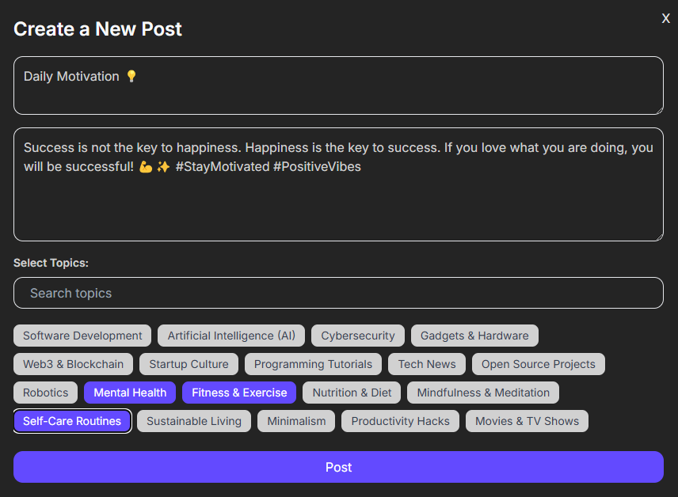
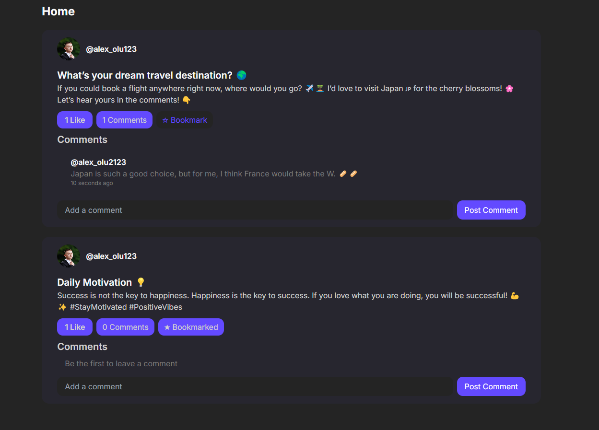
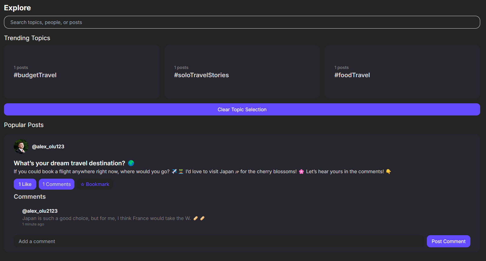
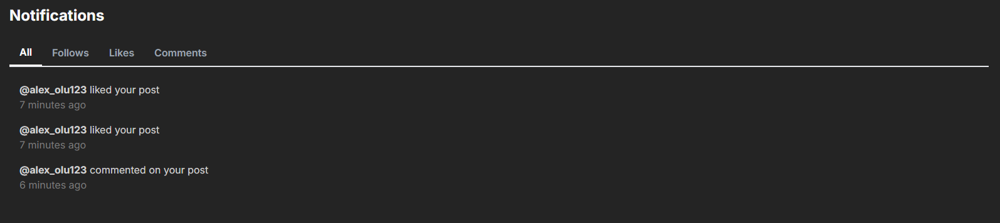
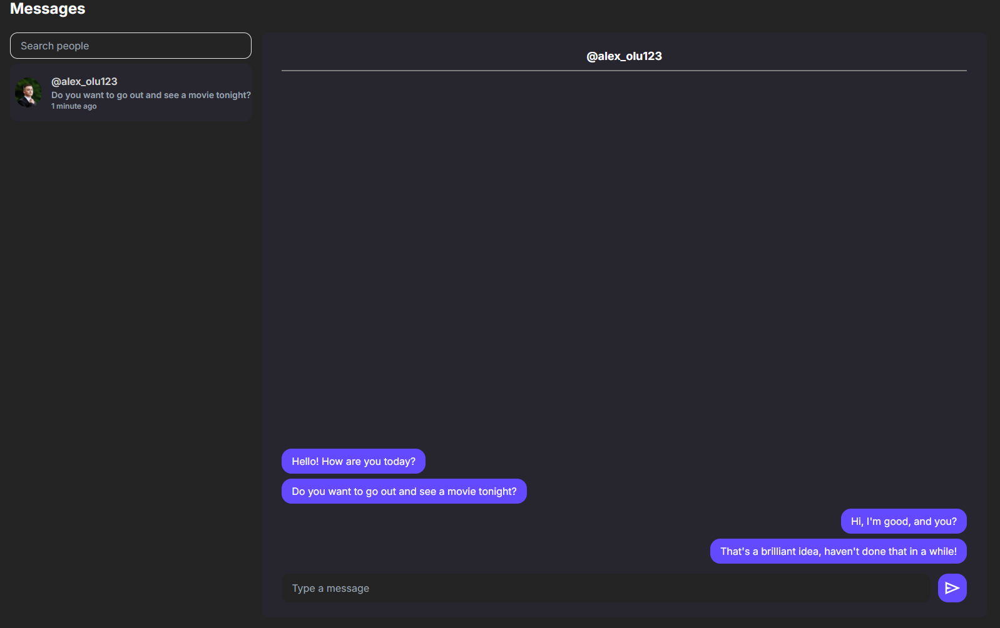
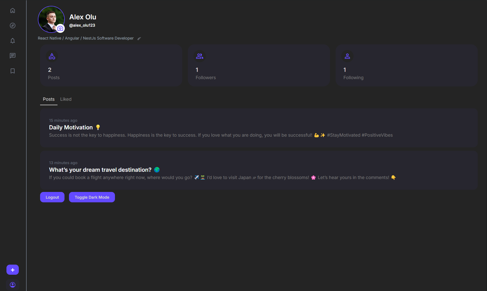

# Lumeo / Social Media WebApp  

Lumeo is a social media platform built using Angular, Tailwind CSS, and Firebase. It provides real-time interaction features for connecting with others and sharing content.

#  Features  

Lumeo allows users to:
- Create posts, like, comment, and bookmark content
- Explore popular topics and search for other users  
- View notifications  
- Chat with friends  
- Access saved bookmarks  
- Manage account settings  

#  Screenshots  

| New Post | Home Screen |  
|----------|------------|  
|  |  |  

| Explore Screen | Notifications |  
|---------------|--------------|  
|  |  |  

| Messages | Bookmarks |  
|---------|-----------|  
|  |  |  

| Profile Screen |  
|---------------|  
|  |  

# Used Technologies
 - **Frontend:** Angular, TailwindCSS
 - **Backend:** Firebase(Authentication, Realtime Database, Storage)
