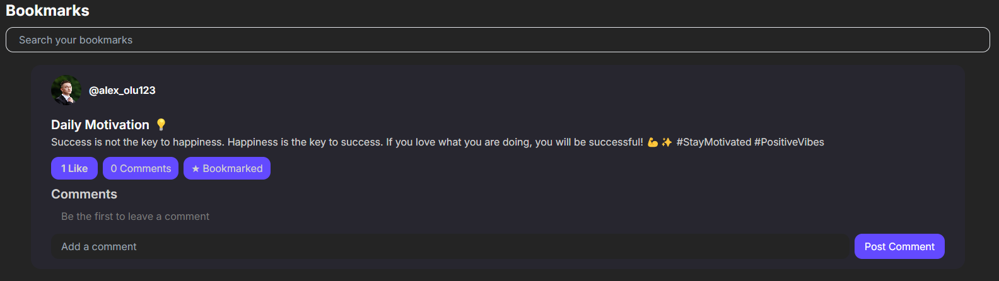

# Lumeo / Social Media WebApp  

Lumeo is a modern social media platform built with Angular, Tailwind CSS, and Firebase. Connect with friends, share posts, and engage with the community in real time.  

#  Features  

In Lumeo, you can:  
✔️ Create new posts, like, comment, or bookmark posts from friends  
✔️ Explore popular posts and topics or search for new people  
✔️ View all your notifications  
✔️ Chat with your friends  
✔️ See your bookmarks  
✔️ Manage your account  

#  Screenshots  

| New Post | Home Screen |  
|----------|------------|  
|  |  |  

| Explore Screen | Notifications |  
|---------------|--------------|  
|  |  |  

| Messages | Bookmarks |  
|---------|-----------|  
|  |  |  

| Profile Screen |  
|---------------|  
|  |  

# Used Technologies
 - **Frontend:** Angular, TailwindCSS
 - **Backend:** Firebase(Authentication, Realtime Database, Storage)
